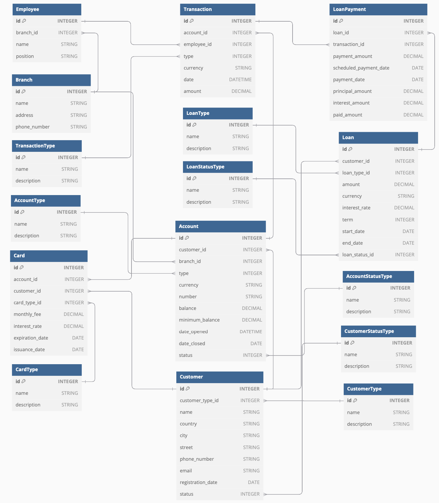

# Bank Account Management System Database with PostgreSQL

##### This project demonstrates the design and implementation of a robust Bank Account Management System using PostgreSQL. It showcases the end-to-end process of database design and management, leveraging conceptual, logical, and physical data modeling techniques to create a reliable and scalable relational database.

### Features

- **Entities**: Accounts, Customers, Loans, Transactions, Branches, Employees, and Cards.

- **Relationships**: Supports customer-account, customer-loan, loan-transaction, employee-branch, and card-account-customer links to ensure data integrity.

- **Constraints**: Enforces unique IDs, non-nullable fields, minimum balance checks, and data consistency.

- **Normalization**: Adheres to a normalized relational model to minimize redundancy.

### Technical Highlights

| Component               | Details                                                                                             |
|-------------------------|-----------------------------------------------------------------------------------------------------|
| Conceptual Design	      | Developed an Entity Relationship Diagram (ERD) to represent entities, attributes, and relationships |
| Logical Modeling        | Created normalized relational schemas to enforce data integrity and relationships                   |
| Physical Implementation | Implemented database design using PostgreSQL, including tables, relationships, and constraints      |
| Schema Objects          | Created 16 tables using SQL DDL (Data Definition Language) commands                                 |
| Data Manipulation       | Populated tables with sample data using DML (Data Manipulation Language) operations                 |
| Data Integrity          | Applied foreign keys, unique constraints, and custom check constraints                              |
| Deployment              | Used Docker Compose to containerize and manage the database locally                                 |
| Administration          | Managed the database using pgAdmin for monitoring, querying, and schema management                  |

### Tools & Technologies

| Technology                   | Usage                                                                               |
|------------------------------|-------------------------------------------------------------------------------------|
| PostgreSQL                   | Relational database management system (RDBMS) for implementation and execution      |
| SQL (DDL/DML)                | Core language for schema creation, data insertion, querying, and updates            |
| Docker & Docker Compose      | Containerization tool for consistent and isolated local deployment                  |
| pgAdmin                      | GUI-based PostgreSQL administration and query management                            |
| Entity-Relationship Modeling | Designed database models and visualized entity relationships for clarity            |
